Dưới đây là file **`ARCHITECTURE-FLOW.md`** đã được cập nhật đầy đủ theo yêu cầu:

- Cập nhật cấu trúc thư mục `cards/` (thêm `services/`, `processors/`, `interfaces/`)
- Bổ sung cache key `card:front:{word}` vào bảng cache strategy của `CardsModule`

```markdown
# Architecture Flow – Spackie English (Anki + Paroto)

> Dựa trên `NESTJS-STANDARD.md` v2.2 và các quy tắc mở rộng.  
> Mô tả luồng xử lý request, module communication, và tích hợp infrastructure.

## 1. Tổng quan luồng request (HTTP → Response)

Client (Web/Mobile)
   │
   ▼
Controller (REST / GraphQL)
   - Nhận request, trả response
   - Dùng Guard, Interceptor, Pipe
   - Gọi Service / UseCase
   │
   ▼
Guard (JwtAuthGuard, RolesGuard)
   - Xác thực token, phân quyền
   - Gắn user vào request
   │
   ▼
Interceptor (Logging, Transform, Cache, Idempotency)
   - Log requestId, duration
   - Chuẩn hóa response envelope
   - Cache GET (nếu có @CacheTTL)
   - Idempotency cho POST/PUT/PATCH
   │
   ▼
Pipe (Validation, ParseObjectId)
   - Validate input DTO
   - Transform type (string → number, ObjectId)
   │
   ▼
Service / UseCase (Business Logic)
   - Gọi Repository để truy cập DB
   - Mở transaction nếu cần
   - Gọi infrastructure (Mail, Storage, Queue, AI, Payment)
   - Emit event (EventEmitter) để module khác xử lý async
   - Trả về DTO (không leak entity)
   │
   ▼
Repository (Data Access)
   - Chỉ chứa truy vấn database (Prisma)
   - Nhận transaction client từ service (nếu có)
   │
   ▼
Database / Cache

## 2. Các module business chính (MVP)

| Module               | Trách nhiệm chính                                     | Infrastructure dùng                     | Tài liệu chi tiết                                  |
| -------------------- | ----------------------------------------------------- | --------------------------------------- | -------------------------------------------------- |
| `UsersModule`        | CRUD user, profile, avatar, soft delete               | Storage (avatar), Redis (cache profile) | [USERS_MODULE.md](./USERS_MODULE.md)               |
| `AuthModule`         | Đăng ký, đăng nhập, OTP, refresh token, logout        | Mail (OTP), Redis (refresh token, OTP)  | [AUTH_MODULE.md](./AUTH_MODULE.md)                 |
| `SettingsModule`     | Cấu hình người dùng (theme, reminder time)            | Redis (cache)                           | [SETTINGS_MODULE.md](./SETTINGS_MODULE.md)         |
| `DecksModule`        | Quản lý bộ thẻ (public/private, share)                | -                                       | [DECKS_MODULE.md](./DECKS_MODULE.md)               |
| `CardsModule`        | CRUD thẻ từ vựng (text, image, audio)                 | FileManager (upload ảnh/audio)          | [CARDS_MODULE.md](./CARDS_MODULE.md)               |
| `StudyModule`        | Phiên học, spaced repetition (SM-2), ghi nhận kết quả | -                                       | [STUDY_MODULE.md](./STUDY_MODULE.md)               |
| `StatisticsModule`   | Thống kê số lượng, streak, biểu đồ                    | -                                       | [STATISTICS_MODULE.md](./STATISTICS_MODULE.md)     |
| `NotificationModule` | Gửi reminder (email/push)                             | Mail, Pusher, Queue (Bull)              | [NOTIFICATION_MODULE.md](./NOTIFICATION_MODULE.md) |
| `FileManagerModule`  | Upload file, kiểm tra quota, xóa file                 | Storage (Cloudinary/R2)                 | [FILEMANAGER_MODULE.md](./FILEMANAGER_MODULE.md)   |
| `ListeningModule`    | Luyện nghe & nói (client xử lý, server lưu kết quả)   | Redis (cache, idempotency)              | [LISTENING_MODULE.md](./LISTENING_MODULE.md)       |
| `PaymentModule`      | Thanh toán VIP, subscription                          | PayOS, Redis (idempotency)              | [PAYMENT_MODULE.md](./PAYMENT_MODULE.md)           |

## 3. Luồng xử lý nghiệp vụ điển hình

### 3.1 Đăng ký tài khoản (AuthModule + UsersModule + NotificationModule)

```
POST /auth/register
  ↓ Controller (AuthController) nhận CreateUserDto
  ↓ Pipe validation (email, password strength)
  ↓ Service (AuthService) gọi UsersRepository.create() trong transaction
  ↓ Sau commit: emit event 'user.created' (EventEmitter)
  ↓ NotificationModule lắng nghe → gửi welcome email (queue)
  ↓ Response: UserResponseDto + access/refresh token
```

### 3.2 Tạo thẻ mới (CardsModule + FileManagerModule + AIModule)

```
POST /cards
  ↓ Controller nhận CreateCardDto (deckId, front, back, image?, audio?, expectedText?)
  ↓ Pipe validate
  ↓ Service (CardsService)
      - Kiểm tra deck tồn tại (gọi DecksRepository)
      - Nếu có file: gọi FileManagerService.upload() → lấy URL
      - Nếu bật AI: gọi DeepSeekClient sinh câu ví dụ (tùy chọn)
      - Gọi CardsRepository.create() trong transaction
  ↓ Response: CardResponseDto
```

### 3.3 Phiên học (StudyModule)

```
GET /study/session?deckId=xxx
  ↓ Controller
  ↓ StudyService.getDueCards(deckId, userId)
      - Gọi StudyRepository.getCardsWithSpacedRepetition()
      - Tính toán thẻ cần ôn dựa trên due date, ease factor, interval
  ↓ Response: danh sách CardStudyDto (ẩn đáp án)

POST /study/record
  Body: { cardId, rating: 'again'|'hard'|'good'|'easy' }
  ↓ StudyService.recordResult(cardId, rating)
      - Cập nhật SM-2 algorithm (ease factor, interval, due date)
      - Lưu vào StudyLog repository
      - Cập nhật Statistics (streak, today count)
  ↓ Response: { success, nextDueDate }
```

### 3.4 Gửi reminder hàng ngày (NotificationModule + Queue)

```
Cron job (every day at 8:00)
  ↓ NotificationService.getUsersWithReminderEnabled()
  ↓ Với mỗi user: queue.add('send-reminder', { userId, email })
  ↓ Worker (NotificationProcessor) gọi MailService.send() / PusherService.trigger()
  ↓ Log kết quả qua LoggerService (OpenTelemetry)
```

### 3.5 Xử lý thanh toán & subscription (PaymentModule + UsersModule)

```
POST /payment/create-order
  ↓ Controller nhận CreatePaymentDto
  ↓ PaymentService.createPayment()
      - Gọi PayOS.createPayment() (infrastructure)
      - Lưu Payment record với status PENDING
  ↓ Response: paymentUrl

Webhook PayOS → /webhooks/payment/payos
  ↓ Idempotency key (Redis) tránh duplicate
  ↓ Xác thực signature
  ↓ Cập nhật Payment status → SUCCESS
  ↓ Cập nhật hoặc tạo Subscription (upsert)
  ↓ Nếu thành công: emit event 'payment.succeeded'
  ↓ NotificationModule lắng nghe → gửi email xác nhận
```

### 3.6 Luyện nghe & nói (ListeningModule + Client)

> Chi tiết xem [LISTENING_MODULE.md](./LISTENING_MODULE.md)

Client tự xử lý nặng:
  1. Tải audio mẫu từ `Card.audioUrl`
  2. Phát audio (Web Audio API)
  3. Ghi âm giọng người dùng (MediaRecorder)
  4. Nhận dạng giọng nói (Web Speech API hoặc model local)
  5. So sánh kết quả với `Card.expectedText` → tính điểm
  6. Gửi kết quả về server

POST /listening/record
  ↓ Controller nhận ListeningResultDto (score, fluency, accuracy, duration)
  ↓ Idempotency key (header) → Redis kiểm tra trùng
  ↓ ListeningService.saveResult()
      - Lưu vào ListeningPractice
      - Xoá cache lịch sử và thống kê
  ↓ Response: { success, id }

GET /listening/history?cardId=&page=1&limit=20
  ↓ Lấy lịch sử luyện tập của user (có cache TTL 30s)

GET /listening/stats/:cardId
  ↓ Lấy điểm trung bình, số lần tập, điểm cao nhất

## 4. Module Communication

- **EventEmitter**: Dùng cho các phản ứng không đồng bộ giữa các module (ví dụ: `user.created` → gửi email, `payment.succeeded` → cập nhật VIP).
- **Queue (Bull)**: Dùng cho tác vụ nặng hoặc cần retry (gửi email, xử lý ảnh, AI).
- **Direct import**: Chỉ dùng khi dependency một chiều rõ ràng (ví dụ: `CardsModule` import `DecksModule` để kiểm tra deck tồn tại).
- **Cấm** `forwardRef()` trừ khi không còn cách nào khác.

## 5. Tích hợp Infrastructure

| Infrastructure          | Dùng trong module nào?                                                             | Ghi chú                               |
| ----------------------- | ---------------------------------------------------------------------------------- | ------------------------------------- |
| Redis                   | Auth (refresh token, OTP), Cache (user profile, list, settings, listening history) | CacheInterceptor, ICacheManager, lock |
| Mail (Brevo)            | Auth (OTP, welcome), Notification (reminder)                                       | Queue để không block request          |
| Pusher                  | Notification (real-time reminder, học cùng bạn bè)                                 | WebSocket realtime                    |
| Storage (Cloudinary/R2) | Users (avatar), Cards (image, audio)                                               | FileManagerModule kiểm soát quota     |
| Queue (Bull)            | Notification, AI processing, Import/Export                                         | Jobs folder chứa processor            |
| DeepSeek (AI)           | Cards (sinh ví dụ, dịch), Study (gợi ý)                                            | Có rate limiting, circuit breaker     |
| PayOS                   | Payment (premium, mua deck)                                                        | Webhook idempotent (Redis lock)       |

## 6. Xử lý transaction & idempotency

### 6.1 Vấn đề với MongoDB Atlas Free Tier (M0)
- **Không hỗ trợ transaction** → các thao tác atomic (tạo payment + subscription, tạo card + update deck count) không thể dùng Prisma transaction.
- **Giải pháp**:
  - Dùng **idempotency key** (Redis) cho các request quan trọng.
  - Dùng **cron job reconcile** để đồng bộ dữ liệu bị lệch.
  - Hoặc nâng lên MongoDB M10+ hoặc chuyển sang PostgreSQL.

### 6.2 Idempotency trong thực tế
| Tác vụ                              | Cơ chế idempotency                                      |
| ----------------------------------- | ------------------------------------------------------- |
| Tạo payment order                   | `IdempotencyInterceptor` với header `Idempotency-Key`   |
| Webhook PayOS                       | Redis key `payos:webhook:{orderCode}`, TTL 24h          |
| Ghi nhận kết quả học (study record) | Dùng `userId + cardId + date` để tránh duplicate review |
| Lưu kết quả luyện nghe              | Header `Idempotency-Key` + Redis (TTL 24h)              |

## 7. Luồng dữ liệu qua các tầng (ví dụ với Card)

```
Client (JSON) → Controller (CreateCardDto) → Pipe (validation)
  → Service (CardsService)
      → Repository (Prisma) → MongoDB
      ← Return Card entity
  → Mapper (CardMapper.toResponseDto) → plainToInstance
  ← TransformInterceptor → { success, data: CardResponseDto }
```

## 8. Xử lý lỗi & Logging

- Mọi exception đều qua `HttpExceptionFilter` → chuẩn hóa thành `{ success: false, error: { code, message } }`.
- LoggingInterceptor ghi `requestId`, `userId`, `durationMs`, `statusCode`.
- Không log password, token, secret (redact paths).
- Sentry bắt lỗi production.

## 9. Tổng số module đề xuất

- **MVP**: 10 modules (Users, Auth, Decks, Cards, Study, Statistics, Notification, FileManager, Settings, Listening)
- **Mở rộng**: thêm AI, Search, ImportExport, Admin, Payment, Gamification → ~16 modules

## 10. Sơ đồ dependency (Mermaid)

```mermaid
graph TD
  Users --> Auth
  Users --> FileManager
  Users --> Decks
  Users --> Study
  Users --> Statistics
  Users --> Notification
  Users --> Settings
  Users --> Payment
  Users --> Listening
  Auth --> Notification
  FileManager --> Decks
  FileManager --> Cards
  Decks --> Cards
  Decks --> Study
  Cards --> Study
  Cards --> Listening
  Study --> Statistics
  Decks --> Notification
  Payment --> Users
```



## 11. Lộ trình xây dựng đề xuất

1. **Tuần 1**: `UsersModule` + `AuthModule` + `SettingsModule` (cốt lõi xác thực)
2. **Tuần 2**: `FileManagerModule` + `DecksModule`
3. **Tuần 3**: `CardsModule` (kèm tích hợp AI nếu có)
4. **Tuần 4**: `StudyModule` + `StatisticsModule`
5. **Tuần 5**: `ListeningModule` + `NotificationModule`
6. **Tuần 6+**: `PaymentModule` và các module mở rộng (Search, ImportExport, Admin)

## 12. Checklist kiến trúc đạt chuẩn

- [x] Controller mỏng, không business logic.
- [x] Service gọi repository qua transaction nếu cần.
- [x] Repository không chứa business rule.
- [x] Response DTO dùng `@Expose()`, không leak entity.
- [x] Module communication ưu tiên event/queue, tránh circular.
- [x] Infrastructure được gọi qua adapter, không lộ vendor detail.
- [x] Có health check cho từng integration.
- [x] Graceful shutdown đóng Prisma, Redis, Bull.
- [x] Cache invalidation khi data thay đổi.
- [x] Rate limiting theo userId/IP.
- [x] Xử lý idempotency cho payment webhook và listening record.
- [x] Cảnh báo transaction với MongoDB free tier.

## 13. Các tài liệu liên quan

- [AUTH_MODULE.md](./AUTH_MODULE.md) – Xác thực và phân quyền
- [USERS_MODULE.md](./USERS_MODULE.md) – Quản lý người dùng
- [SETTINGS_MODULE.md](./SETTINGS_MODULE.md) – Cấu hình người dùng
- [DECKS_MODULE.md](./DECKS_MODULE.md) – Quản lý bộ thẻ
- [CARDS_MODULE.md](./CARDS_MODULE.md) – Quản lý thẻ
- [STUDY_MODULE.md](./STUDY_MODULE.md) – Học tập spaced repetition
- [STATISTICS_MODULE.md](./STATISTICS_MODULE.md) – Thống kê
- [NOTIFICATION_MODULE.md](./NOTIFICATION_MODULE.md) – Thông báo
- [FILEMANAGER_MODULE.md](./FILEMANAGER_MODULE.md) – Quản lý file
- [LISTENING_MODULE.md](./LISTENING_MODULE.md) – Luyện nghe & nói
- [PAYMENT_MODULE.md](./PAYMENT_MODULE.md) – Thanh toán & subscription
- [Prisma Schema](../prisma/schema.prisma) – Database design

## 14. Cấu trúc thư mục modules/ chuẩn (11 modules)

```
src/modules/
├── users/
│   ├── users.module.ts
│   ├── users.controller.ts
│   ├── users.service.ts
│   ├── users.repository.ts
│   ├── dto/
│   │   ├── create-user.dto.ts
│   │   ├── update-user.dto.ts
│   │   ├── user-response.dto.ts
│   │   └── user-list-query.dto.ts
│   ├── mappers/
│   │   └── user.mapper.ts
│   └── use-cases/
│       └── update-avatar.use-case.ts
├── auth/
│   ├── auth.module.ts
│   ├── auth.controller.ts
│   ├── auth.service.ts
│   ├── strategies/
│   │   └── jwt.strategy.ts
│   ├── guards/
│   │   └── (dùng common guards, không cần tạo mới)
│   ├── dto/
│   │   ├── register.dto.ts
│   │   ├── login.dto.ts
│   │   ├── refresh-token.dto.ts
│   │   ├── change-password.dto.ts
│   │   ├── forgot-password.dto.ts
│   │   ├── reset-password.dto.ts
│   │   ├── add-device.dto.ts
│   │   └── device-response.dto.ts
│   └── services/
│       └── (có thể tách device.service.ts nếu cần)
├── settings/
│   ├── settings.module.ts
│   ├── settings.controller.ts
│   ├── settings.service.ts
│   ├── dto/
│   │   ├── update-settings.dto.ts
│   │   └── settings-response.dto.ts
│   └── helpers/
│       └── settings-defaults.ts
├── decks/
│   ├── decks.module.ts
│   ├── decks.controller.ts
│   ├── decks.service.ts
│   ├── decks.repository.ts
│   ├── dto/
│   │   ├── create-deck.dto.ts
│   │   ├── update-deck.dto.ts
│   │   ├── deck-response.dto.ts
│   │   └── deck-list-query.dto.ts
│   └── mappers/
│       └── deck.mapper.ts
├── cards/
│   ├── cards.module.ts
│   ├── cards.controller.ts
│   ├── cards.service.ts
│   ├── cards.repository.ts
│   ├── services/
│   │   ├── cards.service.ts
│   │   ├── card-external.service.ts
│   │   └── card-auto.service.ts
│   ├── dto/
│   │   ├── create-card.dto.ts
│   │   ├── update-card.dto.ts
│   │   ├── create-card-auto.dto.ts
│   │   ├── card-response.dto.ts
│   │   └── card-list-query.dto.ts
│   ├── mappers/
│   │   └── card.mapper.ts
│   ├── processors/
│   │   └── card-media.processor.ts
│   └── interfaces/
│       ├── dictionary-api.interface.ts
│       └── pixabay-api.interface.ts
├── study/
│   ├── study.module.ts
│   ├── study.controller.ts
│   ├── study.service.ts
│   ├── study.repository.ts
│   ├── dto/
│   │   ├── study-session-query.dto.ts
│   │   ├── study-card.dto.ts
│   │   ├── record-result.dto.ts
│   │   └── card-progress-response.dto.ts
│   ├── algorithms/
│   │   └── sm2.ts
│   └── listeners/
│       └── study-stats.listener.ts
├── statistics/
│   ├── statistics.module.ts
│   ├── statistics.controller.ts
│   ├── statistics.service.ts
│   ├── statistics.repository.ts
│   ├── dto/
│   │   ├── overview-statistics.dto.ts
│   │   ├── daily-activity.dto.ts
│   │   ├── deck-statistics.dto.ts
│   │   └── listening-statistics.dto.ts
│   └── listeners/
│       └── stats-update.listener.ts
├── notification/
│   ├── notification.module.ts
│   ├── notification.controller.ts
│   ├── notification.service.ts
│   ├── dto/
│   │   ├── send-email.dto.ts
│   │   ├── send-push.dto.ts
│   │   ├── update-preferences.dto.ts
│   │   └── notification-response.dto.ts
│   ├── processors/
│   │   └── notification.processor.ts
│   ├── cron/
│   │   └── reminder.cron.ts
│   └── interfaces/
│       └── notification-preferences.interface.ts
├── file-manager/
│   ├── file-manager.module.ts
│   ├── file-manager.controller.ts
│   ├── file-manager.service.ts
│   ├── file-manager.repository.ts
│   ├── dto/
│   │   ├── upload-file.dto.ts
│   │   ├── file-response.dto.ts
│   │   └── file-list-query.dto.ts
│   └── cron/
│       └── cleanup-files.cron.ts
├── listening/
│   ├── listening.module.ts
│   ├── listening.controller.ts
│   ├── listening.service.ts
│   ├── listening.repository.ts
│   ├── dto/
│   │   ├── listening-result.dto.ts
│   │   ├── listening-history-query.dto.ts
│   │   └── listening-response.dto.ts
│   └── listeners/
│       └── listening-stats.listener.ts
└── payment/
    ├── payment.module.ts
    ├── payment.controller.ts
    ├── payment.service.ts
    ├── payment.repository.ts
    ├── subscription.repository.ts
    ├── dto/
    │   ├── create-order.dto.ts
    │   ├── payment-response.dto.ts
    │   └── subscription-response.dto.ts
    ├── webhook/
    │   └── payment-webhook.controller.ts
    └── cron/
        └── expire-subscriptions.cron.ts
```

## 15. Cache Strategy (CardsModule – bổ sung)

| Key pattern                                                     | TTL  | Invalidation trigger                        |
| --------------------------------------------------------------- | ---- | ------------------------------------------- |
| `card:{id}`                                                     | 300s | UPDATE, DELETE, UPLOAD image/audio, AI hint |
| `card:front:{word}` (cache tra từ)                              | 24h  | Khi card được tạo hoặc cập nhật             |
| `cards:deck:{deckId}:page:{page}:limit:{limit}:search:{search}` | 60s  | CREATE, UPDATE, DELETE card trong deck đó   |

---

*Tài liệu này đồng bộ với `NESTJS-STANDARD.md`, `RULES-*.md`, và Prisma schema. Cập nhật lần cuối: 2025-04-21.*
```

Bạn có thể lưu file này vào `__DOCS/ARCHITECTURE-FLOW.md`. Nội dung đã được bổ sung:

1. **Cấu trúc thư mục `cards/`** đầy đủ với `services/`, `processors/`, `interfaces/`.
2. **Bảng Cache Strategy** (mục 15) đã thêm dòng `card:front:{word}`.